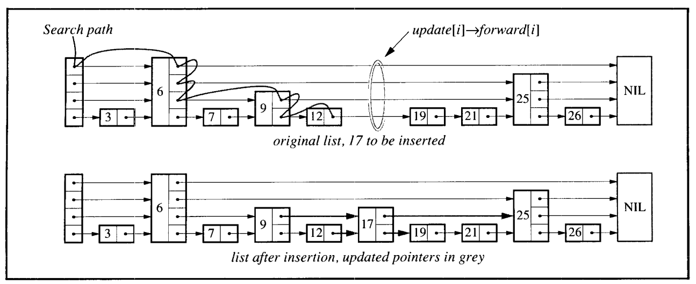

### Java 25 - Skip Lists POC

**Skip Lists implementation with performance benchmarking using JMH**



*Image source:  Pugh, W. (1990). ["Skip lists: A probabilistic alternative to balanced trees"](https://ftp.cs.umd.edu/pub/skipLists/skiplists.pdf). *


### Tech Stack
* Java 25 (LTS)
* Maven 3.x
* JUnit 6.0.3
* JMH 1.37

### ⚙️ Build
```bash
mvn clean package
```

### 🧪 Run Tests
```bash
mvn test
```

### ▶️ Run Application
```bash
java -cp target/classes com.mariofernandes.javapoc.skiplists.Main
```

### 🧠 Benchmark Coverage

The project includes benchmarks for:
- Insert (concurrent)
- Search (read-heavy workload)
- Mixed operations (read + write)

Comparisons are made against:
- ConcurrentSkipListMap

#### 📊 Run Benchmarks (JMH)
```bash
java -jar target/java-skip-lists-poc-1.0-shaded.jar
```

#### 🔎 Run specific benchmark
```bash
java -jar target/java-skip-lists-poc-1.0-shaded.jar SkipListsSearchBenchmark
```

#### 📈 Benchmark Results
Results will be printed in the console after running the benchmarks. Look for metrics like:

##### 📊 INSERT
| Benchmark | Size | Mode | Score | Error | Units |
|----------|------|------|--------|--------|--------|
| ConcurrentSkipListMap | 1,000 | thrpt | 16661.049 | ±430.587 | ops/ms |
| ConcurrentSkipListMap | 10,000 | thrpt | 15908.370 | ±375.679 | ops/ms |
| ConcurrentSkipListMap | 100,000 | thrpt | 15829.177 | ±270.639 | ops/ms |
| MySkipLists | 1,000 | thrpt | 9747.643 | ±34.256 | ops/ms |
| MySkipLists | 10,000 | thrpt | 10098.069 | ±46.371 | ops/ms |
| MySkipLists | 100,000 | thrpt | 9898.058 | ±95.300 | ops/ms |
| ConcurrentSkipListMap | 1,000 | avgt | ≈1e-3 | — | ms/op |
| ConcurrentSkipListMap | 10,000 | avgt | ≈1e-3 | — | ms/op |
| ConcurrentSkipListMap | 100,000 | avgt | ≈1e-3 | — | ms/op |
| MySkipLists | 1,000 | avgt | 0.001 | ±0.001 | ms/op |
| MySkipLists | 10,000 | avgt | 0.001 | ±0.001 | ms/op |
| MySkipLists | 100,000 | avgt | 0.001 | ±0.001 | ms/op |

##### ⚔️ MIXED (Insert + Search)
| Benchmark | Size | Mode | Score | Error | Units |
|----------|------|------|--------|--------|--------|
| ConcurrentSkipListMap | 1,000 | thrpt | 22059.944 | ±117.562 | ops/ms |
| ConcurrentSkipListMap | 10,000 | thrpt | 14209.863 | ±68.718 | ops/ms |
| ConcurrentSkipListMap | 100,000 | thrpt | 9860.049 | ±39.609 | ops/ms |
| MySkipLists | 1,000 | thrpt | 15390.564 | ±191.471 | ops/ms |
| MySkipLists | 10,000 | thrpt | 13719.324 | ±91.924 | ops/ms |
| MySkipLists | 100,000 | thrpt | 9191.260 | ±79.555 | ops/ms |
| ConcurrentSkipListMap | 1,000 | avgt | ≈1e-3 | — | ms/op |
| ConcurrentSkipListMap | 10,000 | avgt | 0.001 | ±0.001 | ms/op |
| ConcurrentSkipListMap | 100,000 | avgt | 0.001 | ±0.001 | ms/op |
| MySkipLists | 1,000 | avgt | 0.001 | ±0.001 | ms/op |
| MySkipLists | 10,000 | avgt | 0.001 | ±0.001 | ms/op |
| MySkipLists | 100,000 | avgt | 0.001 | ±0.001 | ms/op |

##### 🔍 SEARCH
| Benchmark | Size | Mode | Score | Error | Units |
|----------|------|------|--------|--------|--------|
| ConcurrentSkipListMap | 1,000 | thrpt | 50189.736 | ±158.017 | ops/ms |
| ConcurrentSkipListMap | 10,000 | thrpt | 25680.601 | ±71.982 | ops/ms |
| ConcurrentSkipListMap | 100,000 | thrpt | 17931.107 | ±46.831 | ops/ms |
| MySkipLists | 1,000 | thrpt | 50510.987 | ±151.597 | ops/ms |
| MySkipLists | 10,000 | thrpt | 32096.015 | ±95.977 | ops/ms |
| MySkipLists | 100,000 | thrpt | 20572.223 | ±51.372 | ops/ms |
| ConcurrentSkipListMap | 1,000 | avgt | ≈1e-4 | — | ms/op |
| ConcurrentSkipListMap | 10,000 | avgt | ≈1e-4 | — | ms/op |
| ConcurrentSkipListMap | 100,000 | avgt | ≈1e-3 | — | ms/op |
| MySkipLists | 1,000 | avgt | ≈1e-4 | — | ms/op |
| MySkipLists | 10,000 | avgt | ≈1e-4 | — | ms/op |
| MySkipLists | 100,000 | avgt | ≈1e-3 | — | ms/op |